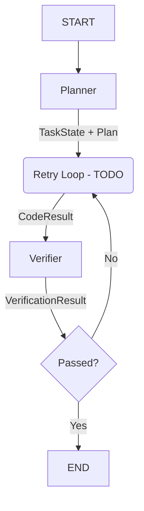

# YSIS_Dev Autonomous System - THE COMPENDIUM (2025-12-19)

> **🚨 CRITICAL INSTRUCTION FOR AI AGENTS:**
> You are entering a **Tier 3 Autonomous Software Factory**. 
> This document is the **Absolute Source of Truth**. Do not guess paths. Do not assume frameworks.
> **READ THIS ENTIRE FILE BEFORE EXECUTING ANY CODE.**

---

## 0. 🧭 Executive Summary
*   **System Name:** YSIS_Dev (formerly YBIS)
*   **Current State:** **Tier 3 Alpha (Functional LangGraph Orchestration)**
*   **Operating System:** Windows (win32) - *Requires careful path handling*
*   **Core Capability:** Autonomous Code Generation, Modification, Testing, and Deployment.
*   **Active Brain:** `OrchestratorGraph` (Event-Driven State Machine).
*   **Interface:** Async CLI + Web Dashboard (`http://localhost:5000`).

---

## 1. 📜 The Constitution (Immutable Mandates)

### Rule 1: The Principle of the Single Path
*   **Dogma:** "There is only one truth for paths, and it lives in Config."
*   **Violation:** Using `os.path.join` with hardcoded strings like `"C:/Projeler"` or `"../"`.
*   **Enforcement:** All paths MUST be imported from `src.agentic.core.config`.
    *   `PROJECT_ROOT`: The anchor.
    *   `DATA_DIR`: `Knowledge/LocalDB`
    *   `TASKS_DB_PATH`: `Knowledge/LocalDB/tasks.json`

### Rule 2: The Principle of Verification (No Broken Windows)
*   **Dogma:** "Untested code is broken code."
*   **Violation:** Committing code without running Sentinel.
*   **Enforcement:** 
    *   `AiderExecutor` runs with `--no-auto-commits`.
    *   `SentinelVerifier` runs strict `pytest`.
    *   If Verification fails, the Graph MUST NOT transition to `END`.

### Rule 3: The Principle of Detachment (Async Execution)
*   **Dogma:** "The Manager (CLI) must never sleep."
*   **Violation:** Running heavy tasks (`run_mission.py`) directly in the main shell.
*   **Enforcement:** Use `auto_dispatcher.py` to spawn detached processes.
    *   *Command:* `python src/agentic/core/auto_dispatcher.py <script_name> <args>`

---

## 2. 🏗️ Architectural Blueprint

### A. The "Brain" (Orchestrator Graph)
The system logic is no longer linear; it is a **State Graph**.



**State Schema (`TaskState` TypedDict):**
```python
{
    "task_id": str,
    "task_description": str,
    "phase": "init" | "plan" | "execute" | "verify" | "done",
    "plan": PlanObject,          # Objective, Steps, Files
    "code_result": CodeResult,   # Files Modified, Commands Run
    "verification": VerResult,   # Tests Passed, Coverage
    "artifacts_path": str        # .sandbox/TASK-ID
}
```

### B. The "Body" (Component Registry)

| Component | File Path | Responsibility | Tech Stack |
|-----------|-----------|----------------|------------|
| **Config** | `src/agentic/core/config.py` | Path Management | `pathlib` |
| **Graph** | `src/agentic/core/graphs/orchestrator_graph.py` | Workflow Logic | `LangGraph` |
| **Planner** | `src/agentic/core/plugins/simple_planner.py` | Task Decomposition | `Ollama (qwen2.5:14b)` |
| **Executor** | `src/agentic/core/plugins/aider_executor.py` | Code Generation | `Aider CLI` + `qwen2.5:32b` |
| **Verifier** | `src/agentic/core/plugins/sentinel.py` | Quality Control | `pytest`, `ast` |
| **Memory** | `src/agentic/core/plugins/rag_memory.py` | Vector Storage | `ChromaDB` + `SentenceTransformers` |
| **Task Board** | `src/agentic/core/plugins/task_board_manager.py` | Task Tracking | `JSON` |
| **Dashboard** | `src/dashboard/app.py` | Visualization | `Flask` + `HTML/CSS` |

---

## 3. 💾 Data Governance (Memory Systems)

### Operational Memory (`tasks.json`)
The system's "RAM". Stores active and backlog tasks.
```json
{
  "backlog": [
    { "id": "T-101", "goal": "Add Dark Mode", "priority": "LOW" }
  ],
  "in_progress": [
    { "id": "T-100", "goal": "Fix Calculator", "priority": "HIGH" }
  ],
  "done": []
}
```

### Deep Memory (`chroma_db`)
The system's "Hippocampus". Stores code embeddings for semantic search.
*   **Model:** `all-MiniLM-L6-v2`
*   **Path:** `Knowledge/LocalDB/chroma_db`
*   **Usage:** Used to find relevant code snippets ("How did we handle errors in the calculator?").

---

## 4. 🔬 Lessons Learned (The Black Box)

These are scars from "The Gauntlet" stress tests. **IGNORE AT YOUR PERIL.**

### 🐛 Issue: The "Aider Resistance"
*   **Symptom:** Aider refuses to use new libraries (e.g., LangGraph) and hallucinates fake classes (`BasicGraph`).
*   **Root Cause:** The model's training data is older than the library.
*   **Fix:** **Knowledge Injection.** You must provide "Cheat Sheets" or boilerplate code in the prompt. Do not assume knowledge.

### 🐛 Issue: The "Path Blindness"
*   **Symptom:** Sentinel says "No tests found" even though tests exist. Aider says "Creating empty file" for existing files.
*   **Root Cause:** Relative paths (`./src`) resolving to Sandbox (`.sandbox/src`) instead of Root (`C:/Projeler/YBIS_Dev/src`).
*   **Fix:** `AiderExecutor` now forces absolute paths relative to `git_root`. Sentinel uses strict path checking with debug logs.

### 🐛 Issue: The "Git Status" Ghost
*   **Symptom:** Sentinel fails to detect changes because Aider committed them immediately. `git status` comes back clean.
*   **Fix:** Forced `--no-auto-commits` on Aider. Orchestrator owns the commit lifecycle.

### 🐛 Issue: The "Rust Panic"
*   **Symptom:** ChromaDB crashes with `pyo3_runtime.PanicException`.
*   **Root Cause:** Corrupted SQLite file or file locking on Windows.
*   **Fix:** Nuke the `Knowledge/LocalDB/chroma_db` folder and restart.

---

## 5. 🚀 Strategic Roadmap (The Vision)

We are climbing the ladder of autonomy.

### ✅ Tier 1: The Assistant (Completed)
*   Basic scripts execution.
*   Manual intervention required.

### ✅ Tier 2: The Loop (Completed)
*   Plan -> Execute -> Verify loop.
*   Sandbox isolation.
*   Basic memory.

### 🚧 Tier 3: The Organization (Current)
*   **LangGraph Integration:** Done.
*   **Async Dispatching:** Done.
*   **Loop Closure (Retry):** **NEXT IMMEDIATE GOAL.** (Connect `Verifier --fail--> Executor`).
*   **Multi-Agent Routing:** Split "Planner" into "Architect" and "Product Owner".

### 🔮 Tier 4: The Sentinel Pro (Future)
*   **Autonomic Maintenance:** Background agents that fix tech debt without being asked.
*   **Self-Healing:** If a build fails in CI, Tier 4 fixes it automatically.

### 👑 Tier 6: The Visionary (Ultimate Goal)
*   **Project OMNI:** The system creates its own UI tools on demand.
*   **Market Awareness:** Scrapes web for trends and proposes features.

---

## 6. 🛠️ Tooling & Command Reference

| Action | Command |
|--------|---------|
| **Start Dashboard** | `python src/agentic/core/auto_dispatcher.py src/dashboard/app.py` |
| **Run Stress Test** | `python src/agentic/core/auto_dispatcher.py run_stress_test_suite.py` |
| **Manual Mission** | `python run_weather_mission.py` |
| **Clean Legacy** | `python run_final_polish.py` |
| **Debug Memory** | `python run_memory_check.py` |

---

> **SYSTEM INTEGRITY STATUS:** 98%
> **READY FOR:** Tier 3 Loop Closure & Advanced Logic.
