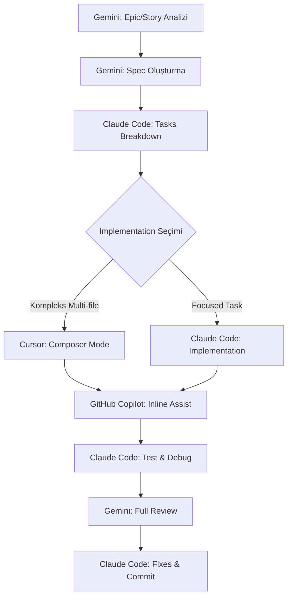

# AI Agent Görev Dağılımı

**Version:** 3.0.0
**Last Updated:** 2025-10-12
**Scope:** Multi-LLM workflow management (.YBIS_Dev scope, project-agnostic)
**Status:** Active

**Cross-References:**
- [YBIS Project Constitution](YBIS_PROJE_ANAYASASI.md) - Technical rules (agents must follow)
- [Development Log](Güncel/DEVELOPMENT_LOG.md) - Architecture Decisions (AD-XXX)
- [Documentation Taxonomy](../.YBIS_Dev/Veriler/documentation-taxonomy.md) - Doc system structure
- [Project Vision](vision/PROJECT_VISION.md) - Strategic foundation
- [Product Roadmap](roadmap/PRODUCT_ROADMAP.md) - Timeline and phases

## Genel Bakış

Bu dokümantasyon, YBIS projesinde kullanılan beş farklı AI asistanının (Claude Code, GitHub Copilot, Cursor, Codex, Gemini) güçlü ve zayıf yönlerini objektif olarak karşılaştırır ve optimal görev dağılımı için öneriler sunar.

---

## Claude Code

### En İyi Olduğu Alanlar
- **Kod yazma ve düzenleme** - Doğrudan dosya manipülasyonu, edit, write araçları
- **Git işlemleri** - Commit, PR oluşturma, branch yönetimi
- **Yapılandırılmış planlama** - Todo listesi, task breakdown
- **Araç kullanımı** - Bash, grep, glob gibi sistem araçları
- **Interaktif debugging** - Hata ayıklama, test çalıştırma
- **Monorepo yönetimi** - Büyük proje yapılarında gezinme

### Zayıf Olduğu Alanlar
- Uzun context reasoning (token limiti var)
- Çok büyük dosyaları okuma (line limit)
- Kompleks mimari tasarım belgeleri yazma

---

## GitHub Copilot

### En İyi Olduğu Alanlar
- **Inline kod tamamlama** - Gerçek zamanlı satır içi öneriler
- **Multi-line suggestions** - Fonksiyon ve blok önerileri
- **Context-aware completion** - Dosya içeriğine göre akıllı tamamlama
- **GitHub entegrasyonu** - Repository pattern learning
- **Çoklu dil desteği** - 40+ programlama dili
- **IDE native entegrasyon** - VS Code, JetBrains seamless integration

### Zayıf Olduğu Alanlar
- Büyük refactoring operasyonları
- Mimari seviye kararlar
- Cross-file dependency yönetimi
- Komple dosya oluşturma
- Git işlemleri

---

## Cursor

### En İyi Olduğu Alanlar
- **AI-powered kod editörü** - Tam entegre AI deneyimi
- **Codebase-wide search** - Tüm proje genelinde context awareness
- **Chat-to-code** - Doğal dilde kod yazma
- **Multi-file editing** - Aynı anda birden fazla dosya düzenleme
- **Intelligent refactoring** - AI destekli refactoring önerileri
- **Auto-debug** - Otomatik hata tespiti ve düzeltme
- **Composer mode** - Kompleks multi-step implementasyon
- **Terminal integration** - AI ile terminal komutları

### Zayıf Olduğu Alanlar
- Git workflow yönetimi (temel seviye)
- Çok büyük codebase analizi (token limiti)
- Stratejik mimari planlama
- Detaylı dokümantasyon yazımı

---

## Codex (OpenAI API)

### En İyi Olduğu Alanlar
- **Kod tamamlama** - API tabanlı öneriler
- **Boilerplate kod** - Hızlı şablon üretimi
- **Test yazma** - Unit/integration test önerileri
- **Dokümantasyon** - JSDoc, yorumlar
- **Pattern matching** - Mevcut kod stilini taklit etme
- **Custom integrations** - API ile özel tooling

### Zayıf Olduğu Alanlar
- Karmaşık mimari kararlar
- Dosya sistemi işlemleri
- Git workflow yönetimi
- Büyük refactoring'ler
- Real-time IDE integration

---

## Gemini

### En İyi Olduğu Alanlar
- **Uzun context analizi** - 1M+ token penceresi
- **Büyük dosya okuma** - Tüm codebase'i bir seferde
- **Mimari dokümantasyon** - Kapsamlı analizler
- **Çoklu dosya karşılaştırma** - System-wide pattern analizi
- **Stratejik planlama** - High-level roadmap
- **Research** - Web search, documentation crawling

### Zayıf Olduğu Alanlar
- Doğrudan kod yazma araçları (Claude Code kadar güçlü değil)
- Real-time debugging
- Git işlemleri

---

## Local Agent (Ollama)

### En İyi Olduğu Alanlar
- **Çevrimdışı Çalışma** - İnternet bağlantısı olmadan çalışabilme.
- **Yerel Dosya Sistemi Erişimi** - Tam dosya sistemi erişimi ve kontrolü.
- **Yerel Shell Erişimi** - Yerel komut satırı araçlarını kullanabilme.
- **Özelleştirilebilir Modeller** - Ollama ile farklı yerel modeller kullanabilme.
- **Maliyet Etkin** - Yerel kaynakları kullandığı için API maliyeti yok.
- **Gizlilik** - Kod ve veriler yerel makinede kalır.

### Zayıf Olduğu Alanlar
- **Sınırlı Bilgi** - Sadece yerel olarak erişebildiği bilgilerle sınırlı.
- **Kurulum ve Bakım** - Ollama ve modellerin kurulum ve bakım gereksinimi.
- **Performans** - Donanım özelliklerine bağlı olarak daha yavaş olabilir.
- **Gelişmiş Araçlar** - Claude Code veya Cursor gibi gelişmiş IDE entegrasyonları yok.

---

## Önerilen Görev Dağılımı

### Gemini'ye Verilecek Görevler
1. Proje genelinde mimari analiz (`/analyze`, `/full-context`)
2. Epic ve story oluşturma (`/YBIS:brownfield-create-epic`)
3. Büyük dokümantasyon okuma/yazma
4. Research ve teknoloji araştırması
5. Multi-file consistency check'ler
6. Kapsamlı code review ve analiz

### Claude Code'a Verilecek Görevler
1. Kod implementasyonu (`/implement`, `/context-implement`)
2. Refactoring (`/YBIS:sc-refactor`)
3. Git operasyonları (commit, PR)
4. Test yazma ve çalıştırma
5. Debugging (`/YBIS:expert-debug`)
6. Dosya düzenleme işlemleri
7. Quick fixes ve hotfix'ler

### Cursor'a Verilecek Görevler
1. Multi-file feature implementation
2. AI-guided refactoring
3. Interactive debugging sessions
4. Composer mode ile kompleks implementasyonlar
5. Rapid prototyping
6. Code exploration ve navigation
7. Terminal-based operations

### GitHub Copilot'a Verilecek Görevler
1. Inline kod yazarken real-time yardım
2. Function ve method completion
3. Repetitive code patterns
4. Quick snippets
5. Comment-to-code generation
6. Import statements

### Codex'e Verilecek Görevler
1. API-based kod generation
2. Custom tooling integrations
3. Batch code generation
4. Automated test case creation
5. Documentation generation
6. Code snippet libraries

### Local Agent'a Verilecek Görevler
1.  İnternet erişimi gerektirmeyen kod oluşturma ve düzenleme.
2.  Hassas verilerle ilgili görevler.
3.  Yerel bağımlılıklar veya araçlarla ilgili otomasyon görevleri.
4.  Çevrimdışı geliştirme senaryoları.

---

## Örnek Workflow

### 1. Feature Geliştirme Süreci



### 2. Adım Adım Görev Akışı

**Faz 1: Planlama (Gemini)**
- Epic analizi yap
- User stories oluştur
- Teknik gereksinimleri belirle
- Output: `spec.md`, `plan.md`

**Faz 2: Task Breakdown (Claude Code)**
- Tasks.md oluştur
- Dependency mapping
- Output: Actionable task list

**Faz 3: Implementation (Cursor veya Claude Code)**
- **Cursor Composer**: Multi-file, kompleks feature'lar
- **Claude Code**: Focused, single-purpose tasks
- **GitHub Copilot**: Yazım sırasında inline yardım
- Output: Working code

**Faz 4: Testing & Debugging (Claude Code)**
- Unit/integration testler
- Bug fixes
- Performance optimization
- Output: Tested, stable code

**Faz 5: Review (Gemini)**
- Full codebase consistency check
- Architecture compliance kontrolü
- Security review
- Output: Review raporu

**Faz 6: Finalization (Claude Code)**
- Review sonrası düzeltmeler
- Documentation updates
- Git commit ve PR oluşturma
- Output: Merged PR

---

## YBIS Slash Komutları İle Entegrasyon

### Gemini İçin
```bash
/YBIS:brownfield-create-epic
/YBIS:full-context
/YBIS:analyze
/YBIS:deep-review
/YBIS:document-project
```

### Claude Code İçin
```bash
/YBIS:implement
/YBIS:context-implement
/YBIS:sc-refactor
/YBIS:expert-debug
/YBIS:qa-gate
/YBIS:review-story
```

### Her İkisi İçin
```bash
/YBIS:tasks
/YBIS:specify
/YBIS:clarify
```

---

## Performans Karşılaştırması

| Görev Tipi | Claude Code | Copilot | Cursor | Codex | Gemini | Önerilen |
|------------|-------------|---------|--------|-------|--------|----------|
| Kod Yazma | ⭐⭐⭐⭐⭐ | ⭐⭐⭐⭐ | ⭐⭐⭐⭐⭐ | ⭐⭐⭐⭐ | ⭐⭐⭐ | Claude Code / Cursor |
| Büyük Dosya Analizi | ⭐⭐ | ⭐ | ⭐⭐⭐ | ⭐ | ⭐⭐⭐⭐⭐ | Gemini |
| Git İşlemleri | ⭐⭐⭐⭐⭐ | ⭐⭐ | ⭐⭐⭐ | ⭐⭐ | ⭐⭐ | Claude Code |
| Inline Completion | ⭐⭐⭐ | ⭐⭐⭐⭐⭐ | ⭐⭐⭐⭐⭐ | ⭐⭐⭐⭐ | ⭐⭐ | Copilot / Cursor |
| Mimari Tasarım | ⭐⭐⭐ | ⭐⭐ | ⭐⭐⭐ | ⭐⭐ | ⭐⭐⭐⭐⭐ | Gemini |
| Debugging | ⭐⭐⭐⭐⭐ | ⭐⭐⭐ | ⭐⭐⭐⭐⭐ | ⭐⭐⭐ | ⭐⭐⭐ | Claude Code / Cursor |
| Documentation | ⭐⭐⭐⭐ | ⭐⭐⭐ | ⭐⭐⭐⭐ | ⭐⭐⭐⭐ | ⭐⭐⭐⭐⭐ | Gemini |
| Test Yazma | ⭐⭐⭐⭐⭐ | ⭐⭐⭐⭐ | ⭐⭐⭐⭐ | ⭐⭐⭐⭐ | ⭐⭐⭐ | Claude Code |
| Refactoring | ⭐⭐⭐⭐⭐ | ⭐⭐⭐ | ⭐⭐⭐⭐⭐ | ⭐⭐⭐ | ⭐⭐⭐⭐ | Claude Code / Cursor |
| Multi-file Edit | ⭐⭐⭐⭐ | ⭐⭐ | ⭐⭐⭐⭐⭐ | ⭐⭐ | ⭐⭐⭐ | Cursor |
| Research | ⭐⭐⭐ | ⭐⭐ | ⭐⭐⭐ | ⭐⭐ | ⭐⭐⭐⭐⭐ | Gemini |
| Rapid Prototyping | ⭐⭐⭐⭐ | ⭐⭐⭐⭐ | ⭐⭐⭐⭐⭐ | ⭐⭐⭐ | ⭐⭐⭐ | Cursor |

---

## Best Practices

### 1. Doğru Agent'ı Seçme
- **Context > 100K token** → Gemini
- **Dosya düzenleme gerekli** → Claude Code
- **Multi-file feature** → Cursor (Composer)
- **Satır içi yardım** → GitHub Copilot (IDE'de aktif tut)
- **API integrations** → Codex

### 2. Workflow Optimizasyonu
```
Gemini (Analiz)
  ↓
Claude Code (Task Breakdown)
  ↓
Cursor/Claude Code (Implementation) + Copilot (Inline)
  ↓
Claude Code (Test & Debug)
  ↓
Gemini (Review)
  ↓
Claude Code (Finalize & Commit)
```

### 3. Kaçınılması Gerekenler
- ❌ Gemini'ye doğrudan kod yazdırma
- ❌ Claude Code'a çok büyük dosya analizi
- ❌ Copilot'a kompleks refactoring
- ❌ Cursor'a stratejik mimari kararlar
- ❌ Codex'e real-time debugging
- ❌ Aynı görevi birden fazla agent'a verme

### 4. Sinerji Oluşturma
- **Gemini + Claude Code**: Analiz → Implementation pipeline
- **Cursor + Copilot**: Multi-file impl + inline assist
- **Claude Code + Gemini**: Implementation → Review loop
- **Copilot (her zaman aktif)**: Arka planda sürekli yardım

### 5. IDE Seçimi ve Entegrasyon
- **VS Code + Claude Code + Copilot**: Genel development
- **Cursor (standalone)**: Kompleks multi-file features
- **Terminal + Claude Code**: Git operations, testing
- **Browser + Gemini**: Research, documentation review

---

## Kullanım Senaryoları

### Senaryo 1: Yeni Feature Geliştirme
```
1. Gemini: Epic oluştur ve spec yaz
2. Claude Code: Tasks breakdown
3. Cursor: Composer mode ile multi-file implementation
4. Copilot: Yazım sırasında inline yardım (her zaman aktif)
5. Claude Code: Tests + debug
6. Gemini: Full review
7. Claude Code: Commit + PR
```

### Senaryo 2: Bug Fix
```
1. Claude Code: Bug'ı reproduce et
2. Cursor veya Claude Code: Fix uygula
3. Copilot: Inline assist
4. Claude Code: Test + commit
```

### Senaryo 3: Refactoring
```
1. Gemini: Refactoring plan oluştur
2. Cursor: Multi-file refactoring (Composer)
3. Claude Code: Test updates
4. Gemini: Consistency check
5. Claude Code: Finalize
```

### Senaryo 4: Documentation
```
1. Gemini: Full analysis + doc generation
2. Claude Code: Doc files oluştur
3. Copilot: Inline JSDoc comments
4. Claude Code: Commit
```

### Senaryo 5: Research & Spike
```
1. Gemini: Tech research + analysis
2. Cursor: Rapid prototyping
3. Copilot: Quick snippets
4. Claude Code: Cleanup + documentation
```

---

## Maliyet Optimizasyonu

### Ücretsiz Katman
- **GitHub Copilot**: Free for students/OSS
- **Cursor**: Free tier (2000 completions/month)
- **Claude Code**: Token-based pricing

### Önerilen Subscription Planı
```
✅ GitHub Copilot: $10/month (her zaman aktif)
✅ Cursor Pro: $20/month (multi-file için)
✅ Claude Pro: $20/month (analysis + implementation)
✅ Gemini Advanced: $20/month (deep analysis)
```

**Toplam**: ~$70/month

**ROI**: 10-20 saat tasarruf/ay = $1000-2000 değer

---

## Versiyonlama

- **Versiyon**: 3.0.0
- **Tarih**: 2025-10-12
- **Son Güncelleme**: Strategic docs eklendi (Vision, Roadmap, Market Research, Competitive Strategy), Documentation architecture (5-Tier system, taxonomy, map) entegre edildi, referanslar güncellendi

---

## Referanslar

### External Documentation
- [Claude Code Documentation](https://docs.claude.com/en/docs/claude-code)
- [GitHub Copilot Docs](https://docs.github.com/en/copilot)
- [Cursor Documentation](https://cursor.sh/docs)
- [Gemini API Docs](https://ai.google.dev/docs)

### YBIS Project Documentation

#### Strategic (Tier -1)
- [Project Vision](vision/PROJECT_VISION.md) - Product vision and growth strategy
- [Product Roadmap](roadmap/PRODUCT_ROADMAP.md) - Timeline and phases
- [Market Research](strategy/MARKET_RESEARCH.md) - Market analysis and opportunities
- [Competitive Strategy](strategy/COMPETITIVE_STRATEGY.md) - Positioning and moats

#### Canonical (Tier 0)
- [YBIS Project Constitution](YBIS_PROJE_ANAYASASI.md) - Technical rules and architectural principles
- [Development Log](Güncel/DEVELOPMENT_LOG.md) - Architecture Decisions (AD-XXX)

#### Reference (Tier 1)
- [Product Requirements](prd/PRODUCT_REQUIREMENTS.md) - Feature requirements
- [Tech Stack](Güncel/tech-stack.md) - Technology versions
- [Package Structure](Güncel/package-structure.md) - Monorepo layout
- [Architecture](Güncel/Architecture_better.md) - Architecture deep-dive
- [Development Guidelines](Güncel/DEVELOPMENT_GUIDELINES.md) - Zero-tolerance rules

#### Execution (Tier 2)
- [Tasks](Güncel/tasks.md) - 6-week development plan (165 tasks)
- [Stories](stories/) - User stories

#### Meta (Tier 4)
- [Documentation Taxonomy](../.YBIS_Dev/Veriler/documentation-taxonomy.md) - Documentation system (25 docs)
- [Documentation Map](../.YBIS_Dev/Veriler/documentation-map.yaml) - Document registry with dependencies
- [Session Context](../.YBIS_Dev/Veriler/memory/session-context.md) - Active session state

### AI System
- [YBIS Slash Commands](../.claude/commands/YBIS/) - Claude Code slash commands
- [Gemini Commands](../.gemini/commands/YBIS/) - Gemini TOML commands
- [Agent Files](../.YBIS_Dev/Veriler/agents/) - AI agent definitions
- [Workflows](../.YBIS_Dev/Veriler/workflows/) - Development workflows
- [Templates](../.YBIS_Dev/Veriler/templates/) - Document templates
- [Commands](../.YBIS_Dev/Veriler/commands/) - Command implementations
